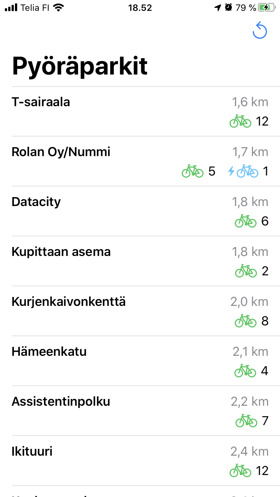

# TurkuBike

<kbd></kbd>

This is an iOS demo app for viewing data from the Turku city bike API detailed at https://data.foli.fi/doc/citybike/v0/index.

## Features

The bikes are available at bike racks around the city center. The racks are listed by name in the main list view. There are regular bikes and e-bikes available, both are listed with a color coded icon.

<kbd></kbd>

The app will request location tracking permissions, and if given, will list the racks by ascending distance from the device location.

<kbd></kbd>

Selecting a rack from the list will open a detail view with a map highlighting the rack location as well as presenting the available bikes and the overall capacity of the rack.

<kbd></kbd>

### Feature support

* Requires iOS 13
* The app supports two languages, English and Finnish
* Dark mode is supported
* Basic accessibility features are supported and large text sizes should function properly
* The list view supports pull-to-refresh and there is a nav bar item available for reloading the data from the server.
* The detail view adopts a custom layout in landscape mode

<kbd></kbd>

### Error handling

* The most notable error conditions are when either the API server does not respond at the given address or the JSON payload received is invalid and does not parse correctly.
* When either of these happen, the user is presented with an error message and given the option to retry the data retrieval. Both conditions could foreseeably be caused by the user being in a low coverage area or heavy congestion of the mobile data link.

<kbd></kbd>

### Limitations

* The application has been developed for use on the iPhone, testing on the iPad was not included in the scope of the development effort.
* Specific accessibility features including support for VoiceOver have not been implemented.
* Although distance tracking updates as the system provides location updates, bike availability counts do not automatically refresh.
